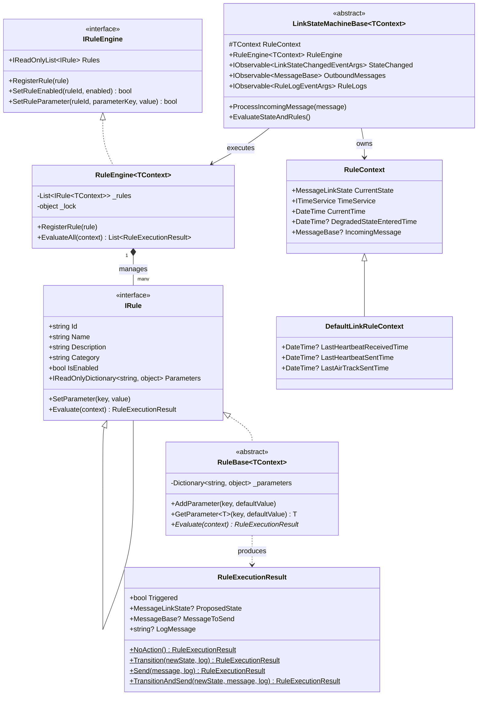
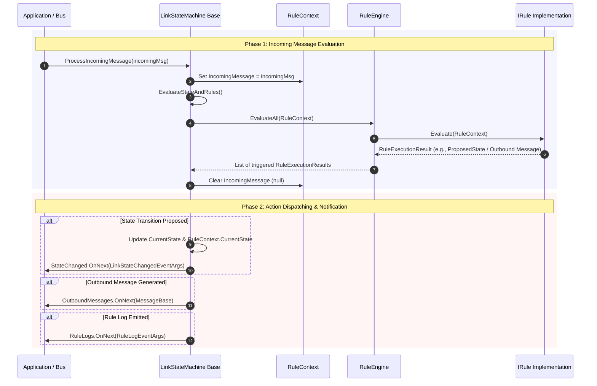
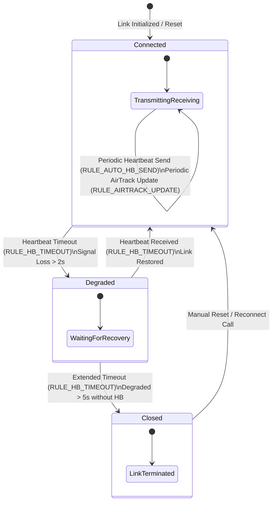
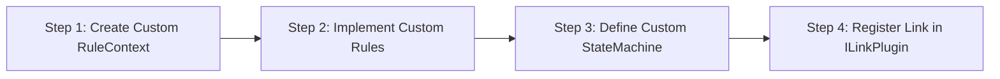

# Rules Engine Technical Documentation & Plugin Guide

## Overview

The **Rules Engine** in `MessageParser` is a flexible, strongly-typed, and decoupled system for evaluating real-time conditions on incoming communication streams, link health telemetry, and state transitions. It manages dynamic state changes (e.g., `Connected` $\rightarrow$ `Degraded` $\rightarrow$ `Closed`), automated message generation (e.g., outbound heartbeats, telemetry updates), and rule parameter configuration at runtime.

This writeup details the architecture of the Rules Engine, its underlying mechanics, step-by-step instructions, and Mermaid diagrams for creating and integrating custom rules inside new plugins.

---

## 1. Core Architecture & Component Overview

The Rules Engine operates on four fundamental abstractions:

1. **`IRule<in TContext>`**: The core interface defining rule metadata (`Id`, `Name`, `Category`, `Parameters`), runtime parameter adjustments (`SetParameter`), and evaluation logic (`Evaluate`). Contravariance (`in TContext`) allows rules defined for base contexts to run against derived context instances.
2. **`RuleContext`**: The state bag passed to rules during evaluation. Contains the link's `CurrentState`, the system clock `ITimeService`, state entry timestamps, and the optional `IncomingMessage`.
3. **`RuleExecutionResult`**: Immutable action descriptor returned by `Evaluate()`. Specifies whether the rule triggered, state transitions to execute (`ProposedState`), messages to transmit (`MessageToSend`), and audit details (`LogMessage`).
4. **`RuleEngine<TContext>`**: Thread-safe manager responsible for storing active rules, updating rule parameters/enabling states dynamically, and executing enabled rules against a context (`EvaluateAll`).
5. **`LinkStateMachineBase<TContext>`**: Coordinates the reactive event loop, listens to `ITimeService.TimeAdvanced` ticks, executes `RuleEngine.EvaluateAll()`, and exposes Reactive Extensions (`IObservable<T>`) streams for state changes, log output, and outbound messages.

### Architecture Class Diagram



---

## 2. How the Rules Engine Works

Evaluation in the Rules Engine is triggered in two ways:
1. **Event-Driven (Incoming Messages)**: When a raw packet is received, parsed, and passed to `ProcessIncomingMessage(msg)`, `RuleContext.IncomingMessage` is populated and `EvaluateStateAndRules()` is invoked.
2. **Time-Driven (Periodic Ticks & Clock Advances)**: A background loop runs every 100ms (or on simulated clock step via `TimeService.TimeAdvanced`), calling `EvaluateStateAndRules()` to evaluate timeout conditions and periodic outbound message triggers.

### Message & Evaluation Sequence Diagram



---

## 3. Link State Machine & Rule Interactions

The state machine maintains link health across three primary states: `Connected`, `Degraded`, and `Closed`. Rules inspect timestamps stored in the `RuleContext` to trigger state transitions or reset link states upon receiving recovery signals.

### State Transition Diagram Driven by Rules



---

## 4. How to Use the Rules Engine in New Plugins

When building a new plugin (e.g., `SatelliteLinkPlugin` or a custom sensor link), follow this 4-step workflow to introduce domain-specific rules, custom contexts, and custom state machines.



### Step 1: Create a Custom `RuleContext`
Extend `RuleContext` if your plugin requires additional tracking variables (such as orbital pass times, signal strengths, or custom message counters).

```csharp
using MessageParser.Core.Rules;
using MessageParser.Core.Simulation;

namespace MessageParser.Plugins.Satellite
{
    public class SatelliteRuleContext : RuleContext
    {
        public DateTime? LastHeartbeatReceivedTime { get; set; }
        public DateTime? LastHeartbeatSentTime { get; set; }

        public SatelliteRuleContext(ITimeService timeService) : base(timeService)
        {
            LastHeartbeatReceivedTime = timeService.Now;
            LastHeartbeatSentTime = timeService.Now;
        }
    }
}
```

### Step 2: Implement Custom Rules
Inherit from `RuleBase<TContext>` to define rules. Use `AddParameter()` in the constructor to establish configurable default thresholds, and use `GetParameter<T>()` in `Evaluate()`.

```csharp
using System;
using MessageParser.Core.Messages;
using MessageParser.Core.Rules;

namespace MessageParser.Plugins.Satellite
{
    public class OrbitPassTimeoutRule : RuleBase<SatelliteRuleContext>
    {
        public override string Id => "RULE_SAT_ORBIT_TIMEOUT";
        public override string Name => "Satellite Orbit Pass Timeout";
        public override string Description => "Degrades satellite link if signal lost for 3s. Closes link if signal lost for 6s.";
        public override string Category => "Satellite State";

        public OrbitPassTimeoutRule()
        {
            // Configurable parameters with default values
            AddParameter("SignalDegradedTimeoutSeconds", 3.0);
            AddParameter("SignalLostCloseTimeoutSeconds", 6.0);
        }

        public override RuleExecutionResult Evaluate(SatelliteRuleContext context)
        {
            if (!IsEnabled) return RuleExecutionResult.NoAction();

            double degradedSec = GetParameter("SignalDegradedTimeoutSeconds", 3.0);
            double closeSec = GetParameter("SignalLostCloseTimeoutSeconds", 6.0);

            // Handle recovery on incoming HeartBeat
            if (context.IncomingMessage is HeartBeat)
            {
                context.LastHeartbeatReceivedTime = context.CurrentTime;
                if (context.CurrentState == MessageLinkState.Degraded)
                {
                    return RuleExecutionResult.Transition(
                        MessageLinkState.Connected,
                        "Satellite lock acquired: Signal restored to Connected state."
                    );
                }
                return RuleExecutionResult.NoAction();
            }

            // Check timeout transitions
            if (context.CurrentState == MessageLinkState.Connected)
            {
                DateTime lastHb = context.LastHeartbeatReceivedTime ?? context.CurrentTime;
                if ((context.CurrentTime - lastHb).TotalSeconds >= degradedSec)
                {
                    context.DegradedStateEnteredTime = context.CurrentTime;
                    return RuleExecutionResult.Transition(
                        MessageLinkState.Degraded,
                        $"Satellite signal fading: No heartbeat for {(context.CurrentTime - lastHb).TotalSeconds:F1}s."
                    );
                }
            }
            else if (context.CurrentState == MessageLinkState.Degraded)
            {
                DateTime degradedStart = context.DegradedStateEnteredTime ?? context.CurrentTime;
                if ((context.CurrentTime - degradedStart).TotalSeconds >= closeSec)
                {
                    return RuleExecutionResult.Transition(
                        MessageLinkState.Closed,
                        $"Satellite out of orbital range. Link closed."
                    );
                }
            }

            return RuleExecutionResult.NoAction();
        }
    }
}
```

### Step 3: Implement Custom StateMachine & Register Rules
Create a state machine class inheriting from `LinkStateMachineBase<TContext>`. Register the rules into `RuleEngine` in the constructor.

```csharp
using MessageParser.Core.Rules;
using MessageParser.Core.Simulation;

namespace MessageParser.Plugins.Satellite
{
    public class SatelliteLinkStateMachine : LinkStateMachineBase<SatelliteRuleContext>
    {
        public override string LinkTypeName => "LEO Satellite Link";

        public SatelliteLinkStateMachine(ITimeService? timeService = null, RuleEngine<SatelliteRuleContext>? ruleEngine = null)
            : base(timeService: timeService, ruleEngine: ruleEngine)
        {
            // Register plugin-specific rules
            RuleEngine.RegisterRule(new OrbitPassTimeoutRule());
            RuleEngine.RegisterRule(new SatelliteTelemetryBroadcastRule());
        }
    }
}
```

### Step 4: Register the Link in `ILinkPlugin`
Expose the new link and state machine to the system by implementing `ILinkPlugin`.

```csharp
using MessageParser.Core.Plugins;

namespace MessageParser.Plugins.Satellite
{
    public class SatelliteLinkPlugin : ILinkPlugin
    {
        public void RegisterLinks(LinkRegistry registry)
        {
            registry.RegisterLink(new LinkDescriptor(
                "LINK_SATELLITE_LEO",
                "LEO Satellite Link",
                "Low Earth Orbit Satellite Communications Link with Orbital Pass and Telemetry rules.",
                timeService => new SatelliteMessageLink(timeService)
            ));
        }
    }
}
```

---

## 5. Runtime Control & Reconfiguration

The Rules Engine allows dynamic tuning of active rules at runtime via UI or configuration services without restarting the application:

```csharp
// Example: Modifying rules via IRuleEngine interface
IRuleEngine engine = stateMachine.RuleEngine;

// 1. Enable / Disable a rule
engine.SetRuleEnabled("RULE_SAT_ORBIT_TIMEOUT", false);

// 2. Reconfigure rule threshold parameter
engine.SetRuleParameter("RULE_SAT_ORBIT_TIMEOUT", "SignalDegradedTimeoutSeconds", 5.0);
```

---

## Summary Checklist for New Plugins

| Task | Component | Description |
| :--- | :--- | :--- |
| **1. Define Context** | `RuleContext` subclass | Add fields needed by your plugin's rules (e.g. timestamps, counters). |
| **2. Write Rules** | `RuleBase<TContext>` subclasses | Implement `Evaluate()`, set `Id`/`Name`/`Category`, and declare configurable parameters. |
| **3. Build State Machine** | `LinkStateMachineBase<TContext>` | Inherit base state machine and register rules in constructor. |
| **4. Implement Plugin** | `ILinkPlugin` | Register link descriptor into `LinkRegistry`. |
| **5. Test** | `RuleEngineAndStateMachineTests` | Verify state transitions, message generation, and parameter updates. |
